# Гаусс пушка

## Схема

Схему можно посмотреть [тут](imgs/scheme.png)

## Компоненты

| Усл. обозн. | Название | Вид | Характеристики |
|-------------|----------|----|----------------|
| R2          | 10WB2RJ         |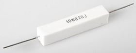| 10 КОм, 10 Вт (керамический) |
| R3          | обычный  | - | 200 Ом               |
| R4          | обычный  | - | 3 КОм |
| R5          | обычный  | - | 1 МОм, 1Вт |
| R6 - R8     | обычный  | - | 10 КОм |
| R9 - R11, R1, R16 | обычный | - | 300 Ом |
| R12 - R15   | 20W3R9J |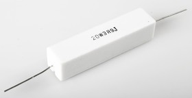| 20 КОм, 20 Вт (керамический) |
| D2-D4 | светодиод из ардуино | 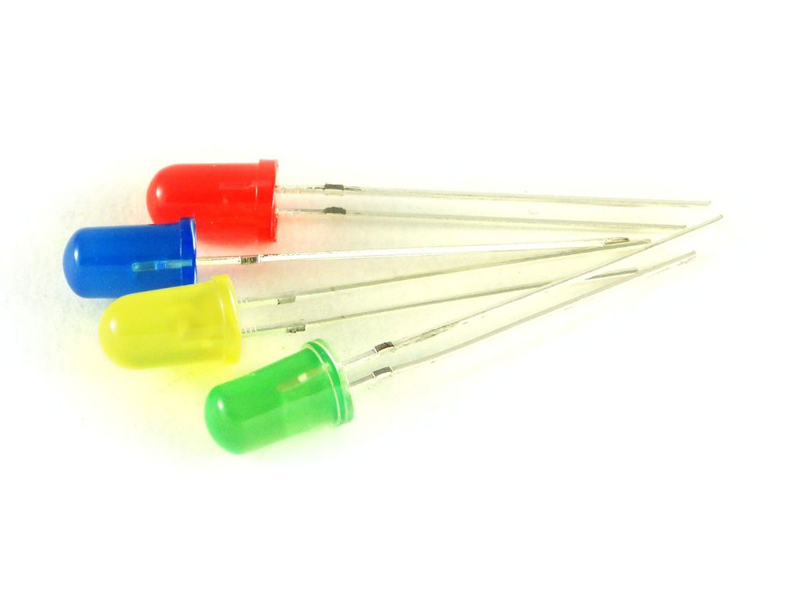| хз, самые простые 🤷‍♂️ |
| D1    | MUR1560G | 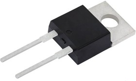| 15А, 600В |
| C1, C2| конденсатор | 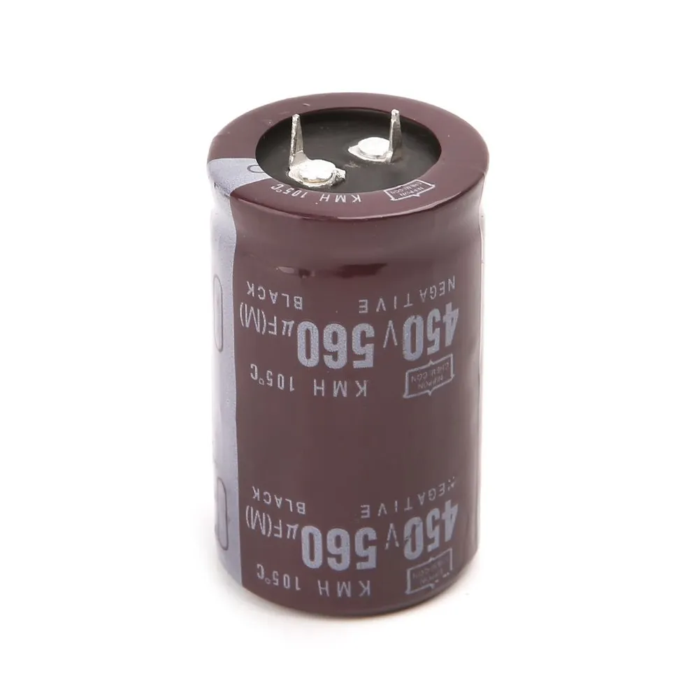| 450В, 560 мкФ |
| Q1 | Тиристор BT152-800R | 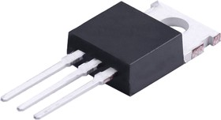| 20А, 800В |
| Q2 | Транзистор BC847 | 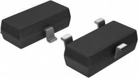| 45В, 0.1А |
| U1 | Оптопара MOC3052M | 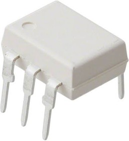| - |
| - | Реле ардуино | 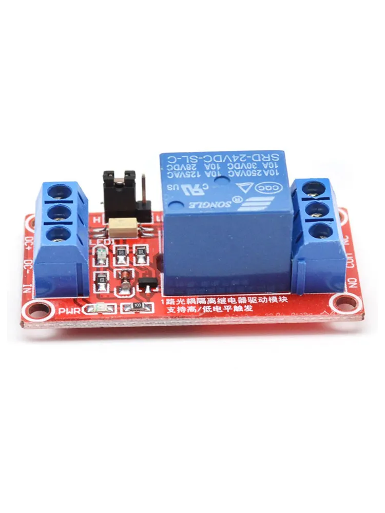| - |
| - | Повышающий преобразователь | 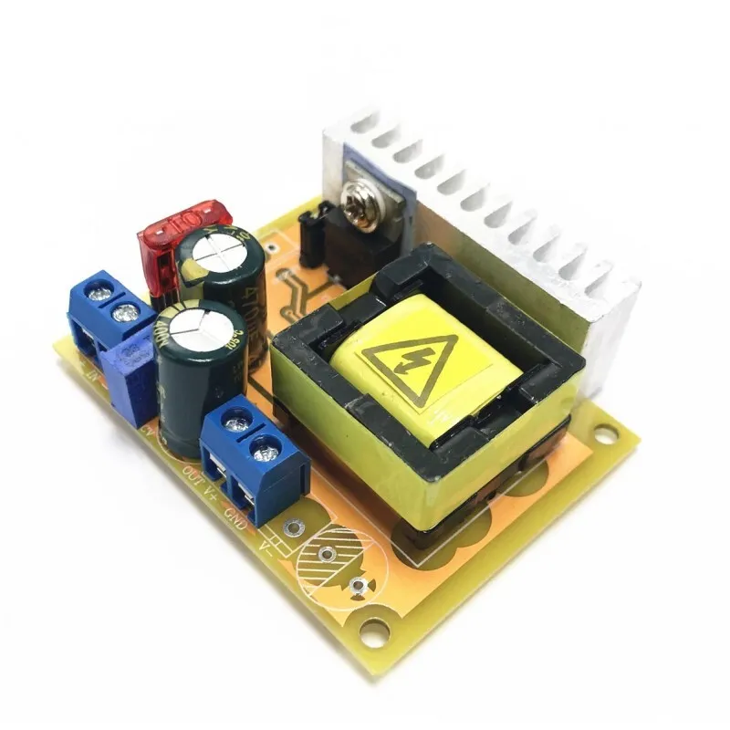| 10-32 в 45-390В |
| - | Arduino Uno | 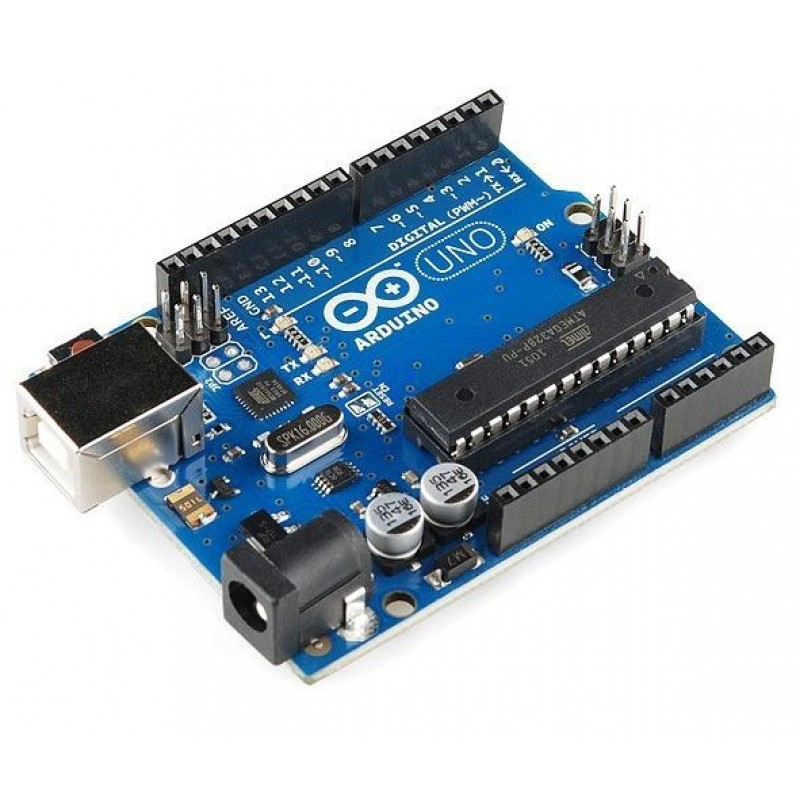| - |
| - | LCD1602 | | - |
| SW1, SW2 | Переключатель | - | - |
| SW3, SW4 | Кнопки | 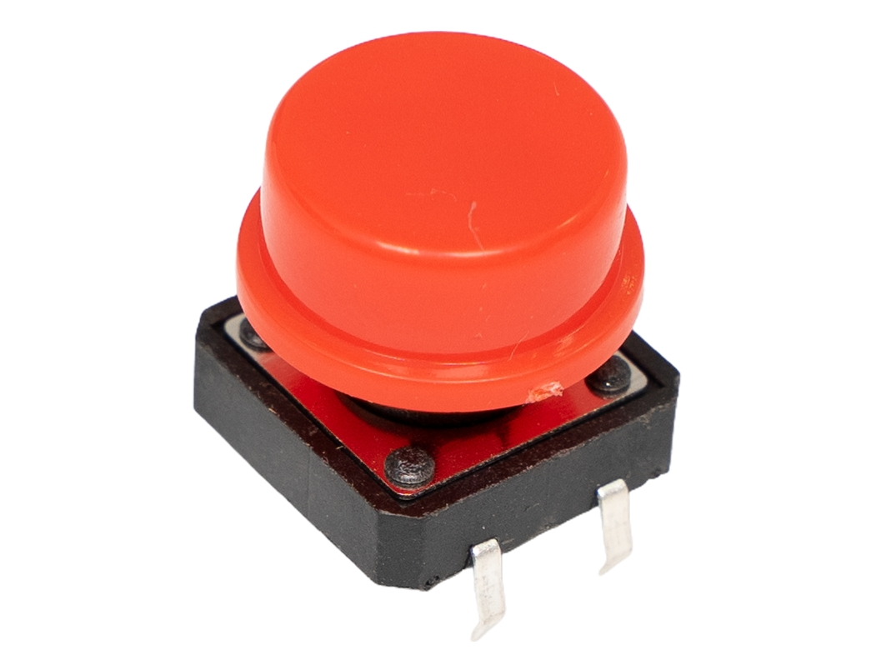| Я взял из набора ардуино |
